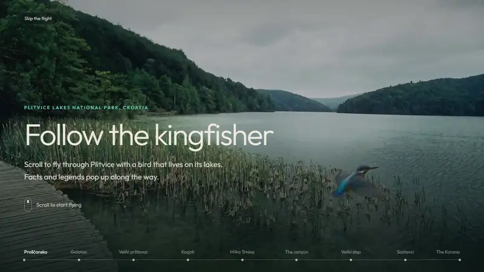
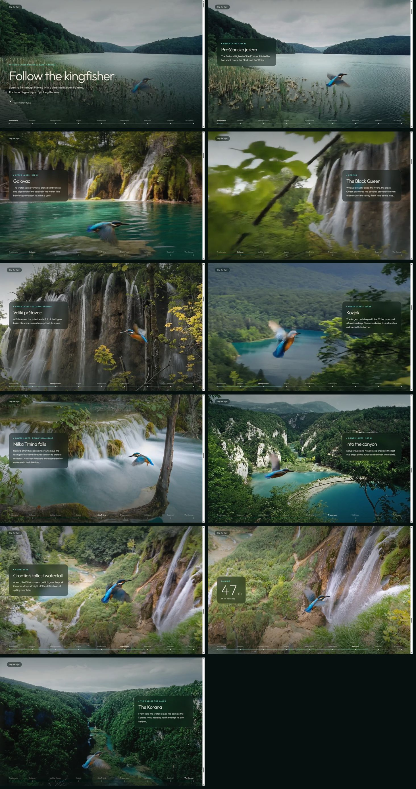
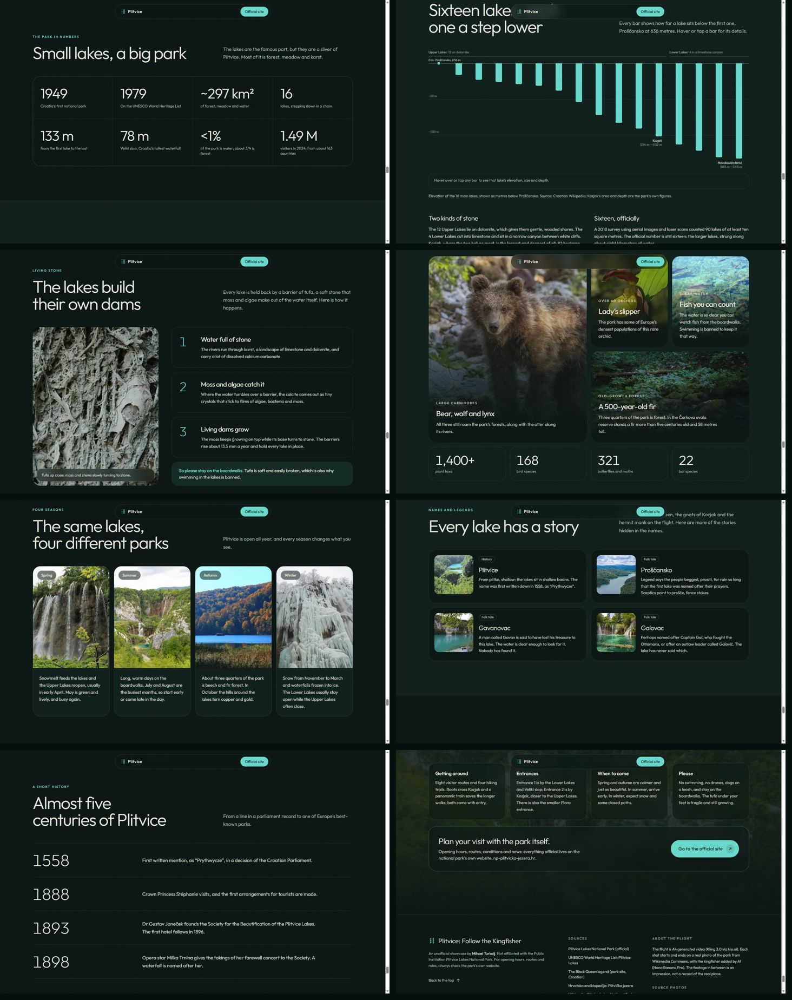
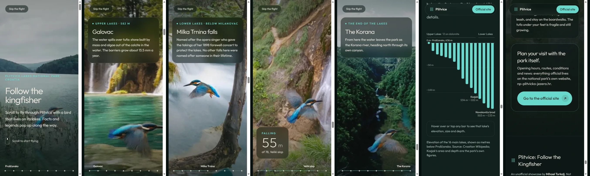

# Plitvice: Follow the Kingfisher



**Live site:** https://mihael-turkalj.github.io/plitvice-flight/

An unofficial showcase of Plitvice Lakes National Park. You scroll to fly through the park behind a kingfisher: from the highest lake, through the Upper and Lower Lakes, down the 78 m of Veliki slap and out along the Korana. Knowledge cards pop up along the way (facts, legends and elevations), and a counter tracks the metres fallen during the dive. Scrolling back rewinds the flight.

**Status:** complete. The flight is 40 seconds long, in 8 shots and 14 cards. Below it, eight sections tell the rest of the story: the park in numbers, a chart of the 16 lakes stepping down, how tufa builds the dams, wildlife, the four seasons, the stories behind the lake names, a history timeline, and visitor notes. The only outbound links go to the national park's official website; there are no ticket links.





## How it was built

| | |
|---|---|
| **Approach** | AI-generated video (kie.ai) driven by scroll, instead of a design skill |
| **Video model** | Kling 3.0, Pro mode (1080p), 5 s per shot, with a first and last frame |
| **Keyframes** | Real Wikimedia Commons photos of the park, with the kingfisher added by Nano Banana Pro |
| **Card motion** | Emil Kowalski's `animate` skill |
| **Stack** | Vite, React, TypeScript, Tailwind CSS 4, GSAP ScrollTrigger |
| **QA** | Playwright (Edge) at 375 × 812 and 1440 × 900 |
| **Impeccable hooks** | Off during the build |

The site replaces an earlier photo-based version built with the `gpt-taste` skill, which didn't feel like movement.

### The pipeline

1. **Keyframe.** A real photo of each stop, cropped to 16:9. Nano Banana Pro adds a small, realistic kingfisher, using the previous keyframe as a reference so it stays the same bird. Each keyframe puts the bird in a different place and pose, which forces it to fly across the frame. People in the photos are edited out, because video models warp them.
2. **Shot.** Kling 3.0 generates 5 s between two consecutive keyframes. The prompt asks for an FPV chase, a bird flying freely around the frame, and a plunge through a patch of leaves that comes out at the next place. That transition also hides most of the AI-invented in-between.
3. **Encode per shot.** Each shot is its own file, and each shot's first frame is dropped, because it repeats the previous shot's last frame. Files are H.264 with a keyframe every 10 frames and no B-frames, so jumping to any point stays fast. Two sizes: 1600×900 (about 4 MB per shot) and 720p (about 2.5 MB). The page downloads them in flight order, so the first shot is playable after about 4 MB instead of the whole 35 MB (22 MB on phones).
4. **Bird tracking.** A small OpenCV script finds the kingfisher in every frame. Frames where a blob shows *both* its electric blue and its orange are anchors. In between, the tracker takes the blue blob nearest the anchor path. A lake alone is never orange, and orange tufa alone is never blue. On a phone, which shows only the middle third of the wide video, the visible window slides to follow the bird.
5. **Page.**
   - Each shot is downloaded in full as a local blob before it's used, so seeking inside it never stalls.
   - Scroll position sets the playhead. At a join the page swaps to the next file, which has already been lined up on its matching frame, so nothing flashes.
   - Each card is a CSS transition switched on by a data attribute, so it reverses cleanly when you scroll back.
   - With reduced motion turned on, the flight becomes nine stills with the same cards.

### Below the flight

- **Built without a separate design skill.** The sections reuse the site's own system (Outfit, the dark lake palette, glass panels) so they read as one page.
- **Reveal motion:** each block fades and rises into place once, with the strong ease-out from the `animate` skill. With reduced motion turned on, blocks simply appear.
- **The staircase chart** follows the `dataviz` skill:
  - One colour, and bars hanging from a zero line at Prošćansko, so every bar is a true length (metres below the first lake) rather than a cut-off elevation axis.
  - Only three lakes are labelled directly.
  - Hovering, focusing or tapping a bar fills a readout under the chart, so nothing covers the bars.
  - A full table holds every value.
- **Photos:** 13 real Commons photos. They are credited under the footer's "Photo credits" link, because most are CC BY or CC BY-SA, which require attribution.
- **Content:** the text lives in `src/data/park.ts`.

### Cost (kie.ai, 1 credit = $0.005)

| Step | Credits |
|---|---|
| Test 1: two models compared (Veo 3.1 Fast won on the bird, Kling 3.0 on energy) | 166 |
| Test 2: bird placed in the keyframes vs added by the model (placing it won) | 176 |
| First stretch: 2 Pro shots, 2 keyframes and 1 clean-up (plus 1 failed shot, refunded) | 234 |
| Second stretch: 5 keyframes and 4 Pro shots (the first dive attempt was unusable) | 450 |
| Finish: 1 keyframe, the dive redone, the last shot, and the middle shot redone in Pro | 288 |
| **Total** | **1,314 (about $6.60)** |

Rough prices: 18 credits per Nano Banana Pro keyframe, 70 per Kling 3.0 Standard 5 s shot (720p), 90 per Pro shot (1080p), and 60 per Veo 3.1 Fast 8 s shot.

## What we learned

1. **The bird decides whether it looks real or AI.** A large, symmetrical bird pasted dead-centre stayed frozen like a sticker. A small, side-on bird, placed in *different* spots in the start and end frames, flies freely.
2. **The model forgets a bird that isn't in the keyframes.** Clean photos plus "a kingfisher darts across" showed a bird for a second, then lost it.
3. **Kling vs Veo is a trade-off.** Veo 3.1 animated the wings more naturally, but ghosted the bird for a moment. Kling 3.0 gave the camera energy and the "through the leaves" transition the client preferred.
4. **A wide video on a phone needs a plan.** Cropping to the centre lost the bird almost all the time; following it with colour tracking fixed that.
5. **Viewpoints in a shot must connect.** The first dive went from an aerial view of Veliki slap to a ground-level view of its base. Kling couldn't join two unrelated viewpoints with one camera move, so it cross-faded between them. The fix: make the end keyframe from a zoomed-in crop of the *same* photo, so the shot becomes one push-in down the fall.
6. **Long generations need saved job IDs.** A Pro job outlived a script's time limit and its ID was lost until it was recovered from the kie.ai dashboard. The client now saves every job ID the moment it's created.

## Run it

```bash
npm install
npm run dev      # http://localhost:5173
npm run build    # static site in dist/, relative paths so it works on GitHub Pages
```

Every push to `main` builds and publishes the site through the workflow in `.github/workflows/deploy.yml`.

## Credits and disclaimer

The flight is AI-generated. Each shot starts and ends on a real photo of the park (Wikimedia Commons, credited in the site footer and in `src/data/credits.json`), but the footage in between is an impression, not a record of the real place. Facts come from the park's own site, UNESCO, Hrvatska enciklopedija and Wikipedia.

This is an unofficial portfolio piece by [Mihael Turkalj](https://mihaelturkalj.com). It is not affiliated with the Public Institution Plitvice Lakes National Park. For tickets and rules, use [np-plitvicka-jezera.hr](https://np-plitvicka-jezera.hr/en/).


